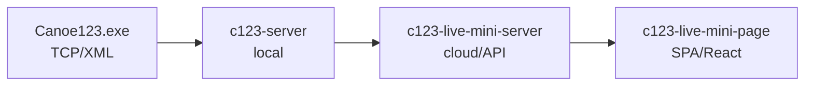

# c123-live-mini

Minimalistic live results solution for C123 timing ecosystem.

## Required Context

**Before running any Spec-Kit command, always read:**

- [docs/ARCHITECTURE.md](docs/ARCHITECTURE.md) - System design, data flows, merge strategy, authentication

This ensures specs are consistent with architectural decisions.

---

## SDD Workflow

This project uses Spec-Driven Development. Full methodology:
https://github.com/jakubbican/gh-sdd-ai-workflow

### Issue Types

| Type | Label | Purpose |
|------|-------|---------|
| Feature | `type/feature` | New functionality, triggers Spec-Kit |
| Task | `type/task` | Implementation unit from spec |
| Bug | `type/bug` | Bug fix, no spec needed |
| Feedback | `type/feedback` | Feedback on existing feature |

### Feature Workflow

1. **Create Feature issue** on GitHub (label: `type/feature`, `spec/draft`)
2. **Read issue and run Spec-Kit:**
   - `/speckit.specify` with issue content
   - `/speckit.clarify` - answer questions
   - `/speckit.plan` - technical plan
   - `/speckit.tasks` - generate tasks
3. **Create task issues:** `/speckit.taskstoissues`
4. **Change label** to `spec/approved`
5. **Implement tasks**, commit with `Closes #N`

### Branching Strategy

| Issue Type | Branch Pattern | Example |
|------------|----------------|---------|
| Feature | `feature/{N}-{slug}` | `feature/42-ingest-api` |
| Bug | `fix/{N}-{slug}` | `fix/99-ws-reconnect` |
| Task | (no branch) | Commits on feature branch |

### Daily Work

```bash
gh issue list -l "status/wip"              # What's in progress
gh issue edit N --add-label "status/wip"   # Claim task
# ... work ...
git commit -m "feat: X\n\nImplements #N"   # Task commit
gh pr create --body "Closes #Feature"      # Feature PR
```

### Spec-Kit Commands

| Command | Function |
|---------|----------|
| `/speckit.specify` | Create spec from description |
| `/speckit.clarify` | Refine spec (max 5 questions) |
| `/speckit.plan` | Technical implementation plan |
| `/speckit.tasks` | Generate task list |
| `/speckit.taskstoissues` | Create GitHub issues from tasks |

---

## Project Context

> **Full architecture details:** [docs/ARCHITECTURE.md](docs/ARCHITECTURE.md)

### Architecture



### Tech Stack

| Component | Technology |
|-----------|------------|
| Monorepo | npm workspaces |
| Backend | Node.js, TypeScript, Fastify |
| Database | SQLite + Kysely (Repository Pattern) |
| Frontend | React + Vite |
| Design System | rvp-design-system (public) |
| Deployment | Railway (planned) |

### Related Projects

| Project | Purpose | Link |
|---------|---------|------|
| c123-protocol-docs | C123 protocol (XML, TCP) | `../c123-protocol-docs` |
| c123-server | Local timing server + Admin UI | `../c123-server` |
| rvp-design-system | Public apps design system | [GitHub](https://github.com/CzechCanoe/rvp-design-system/) |
| timing-design-system | Internal timing tools DS | [GitHub](https://github.com/OpenCanoeTiming/timing-design-system/) |

### Design Systems

| Design System | Purpose | Used In |
|--------------|---------|---------|
| **rvp-design-system** | Public-facing CSK apps | live-mini-page (this project) |
| **timing-design-system** | Admin/internal tools | c123-server Admin UI |

**Important:** Frontend must strictly use rvp-design-system. No inline styles or local overrides. If a component is missing, use unstyled and report the requirement.

### Conventions

- **Language:** Code and commits in English
- **Communication:** Czech or English
- **API:** Headless, JSON-based
- **Admin:** Via c123-server UI (not in this project)
- **Frontend:** Mobile-first, rvp-design-system only

## Active Technologies
- TypeScript 5.x, Node.js 20.x LTS + npm workspaces (built-in), TypeScript, tsx (dev runner) (001-monorepo-setup)
- N/A (no database in this feature) (001-monorepo-setup)

## Recent Changes
- 001-monorepo-setup: Added TypeScript 5.x, Node.js 20.x LTS + npm workspaces (built-in), TypeScript, tsx (dev runner)
