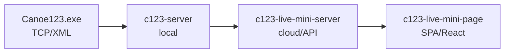

# c123-live-mini

Minimalistic live results solution for C123 timing ecosystem.

## Required Context

**Before running any Spec-Kit command, always read:**

- [docs/ARCHITECTURE.md](docs/ARCHITECTURE.md) - System design, data flows, merge strategy, authentication

This ensures specs are consistent with architectural decisions.

---

## SDD Workflow

This project uses Spec-Driven Development. Full methodology:
https://github.com/jakubbican/gh-sdd-ai-workflow

### Issue Types

| Type | Label | Purpose |
|------|-------|---------|
| Feature | `type/feature` | Main work unit, tracked in GitHub |
| Task | `type/task` | Optional - tasks live in `tasks.md` |
| Bug | `type/bug` | Bug fix, no spec needed |
| Feedback | `type/feedback` | Routes to spec update or bug |

### Feature Workflow

1. **Create Feature issue** (label: `type/feature`, `spec/draft`)
2. **Create branch** and **link to issue**
3. **Run Spec-Kit phases** - update issue after each:
   - `/speckit.specify` → update issue
   - `/speckit.clarify` → update issue
   - `/speckit.plan` → update issue
   - `/speckit.tasks` → update issue
4. **Implement per phase** - commit + push + update issue after each
5. **Create PR** with `Closes #N`

### Branching Strategy

| Issue Type | Branch Pattern | Example |
|------------|----------------|---------|
| Feature | `feature/{N}-{slug}` | `feature/2-data-model` |
| Bug | `fix/{N}-{slug}` | `fix/99-ws-reconnect` |

---

## Recommended Prompts

### Starting a Feature

```
Read Feature issue #N and create branch feature/N-{slug}.
Add comment to issue with branch link.
```

### Spec Phases

```
Read Feature issue #N and run /speckit.specify with its content.
After completion, update the issue with link to spec.md and status.
```

```
/speckit.clarify
After completion, update Feature issue #N with status.
```

```
/speckit.plan
After completion, update Feature issue #N with links to plan.md and status.
```

```
/speckit.tasks
After completion, update Feature issue #N with phase breakdown from tasks.md.
```

### Implementation (ITERATIVE - per phase)

```
/speckit.implement next incomplete phase from Feature #N.
After completion: commit all changes, push, update Feature issue with progress.
```

### Feature Completion

```
Create PR for Feature #N. Include summary of all phases and 'Closes #N' in body.
```

---

## Feature Issue Updates (REQUIRED)

**After EVERY Spec-Kit command or implementation phase, update the Feature issue.**

### After Spec Phase

```markdown
## Spec Phase Complete ✓

**Branch:** [feature/N-name](../../tree/feature/N-name)

### Created
- [spec.md](../../blob/feature/N-name/specs/00N-name/spec.md)

### Status
- [x] /speckit.specify
- [ ] /speckit.clarify
- [ ] /speckit.plan
- [ ] /speckit.tasks
- [ ] Implementation

### Next
Run `/speckit.clarify` to refine the spec.
```

### After Implementation Phase

```markdown
## Phase X Complete ✓

### Tasks Implemented
- [x] T001-T005 (Setup)
- [x] T006-T008 (Foundation)

### Commits
- `abc123` feat: add monorepo structure

### Next
Phase 3: User Story 1 (T009-T020)
```

---

## Project Context

> **Full architecture details:** [docs/ARCHITECTURE.md](docs/ARCHITECTURE.md)

### Architecture



### Tech Stack

| Component | Technology |
|-----------|------------|
| Monorepo | npm workspaces |
| Backend | Node.js, TypeScript, Fastify |
| Database | SQLite + Kysely (Repository Pattern) |
| Frontend | React + Vite |
| Design System | rvp-design-system (public) |
| Deployment | Railway (planned) |

### Related Projects

| Project | Purpose | Link |
|---------|---------|------|
| c123-protocol-docs | C123 protocol (XML, TCP) | `../c123-protocol-docs` |
| c123-server | Local timing server + Admin UI | `../c123-server` |
| rvp-design-system | Public apps design system | [GitHub](https://github.com/CzechCanoe/rvp-design-system/) |
| timing-design-system | Internal timing tools DS | [GitHub](https://github.com/OpenCanoeTiming/timing-design-system/) |

### Design Systems

| Design System | Purpose | Used In |
|--------------|---------|---------|
| **rvp-design-system** | Public-facing CSK apps | live-mini-page (this project) |
| **timing-design-system** | Admin/internal tools | c123-server Admin UI |

**Important:** Frontend must strictly use rvp-design-system. No inline styles or local overrides.

### Conventions

- **Language:** Code and commits in English
- **Communication:** Czech or English
- **API:** Headless, JSON-based
- **Admin:** Via c123-server UI (not in this project)
- **Frontend:** Mobile-first, rvp-design-system only

## Active Technologies
- TypeScript 5.x (Node.js 20 LTS) + Fastify, Kysely, better-sqlite3 (002-data-model)
- SQLite (file-based, Repository Pattern) (002-data-model)

## Recent Changes
- 002-data-model: Added TypeScript 5.x (Node.js 20 LTS) + Fastify, Kysely, better-sqlite3
