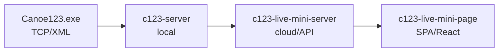

# c123-live-mini

Minimalistic live results solution for C123 timing ecosystem.

## Required Context

**Before running any Spec-Kit command, always read:**

- [docs/ARCHITECTURE.md](docs/ARCHITECTURE.md) - System design, data flows, merge strategy, authentication

This ensures specs are consistent with architectural decisions.

---

## SDD Workflow

This project uses Spec-Driven Development. Full methodology:
https://github.com/jakubbican/gh-sdd-ai-workflow

### Issue Types

| Type | Label | Purpose |
|------|-------|---------|
| Feature | `type/feature` | Main work unit, tracked in GitHub |
| Task | `type/task` | Optional - tasks live in `tasks.md` |
| Bug | `type/bug` | Bug fix, no spec needed |
| Feedback | `type/feedback` | Routes to spec update or bug |

### Mandatory Label Transitions

| Trigger | Command |
|---------|---------|
| After `/speckit.tasks` | `gh issue edit N --remove-label "spec/draft" --add-label "spec/approved"` |
| Start implementation | `gh issue edit N --add-label "status/wip"` |
| Before PR | `gh issue edit N --remove-label "status/wip"` |

### Feature Workflow

1. **Create Feature issue** (label: `type/feature`, `spec/draft`)
2. **Run `/speckit.specify`** - creates branch `###-feature-name` and **link to issue**
3. **Run Spec-Kit phases** - update issue after each:
   - `/speckit.specify` → creates branch + update issue
   - `/speckit.clarify` → update issue
   - `/speckit.plan` → update issue
   - `/speckit.tasks` → update issue + **change label to `spec/approved`**
4. **Start implementation** → **add `status/wip` label**
5. **Implement per phase** - commit + push + update issue after each
6. **Before PR** → **remove `status/wip` label**
7. **Create PR** with `Closes #N`

### Branching Strategy

> Branch names use spec-kit format `###-feature-name` which matches `specs/` directory.

| Issue Type | Branch Pattern | Example |
|------------|----------------|---------|
| Feature | `###-feature-name` (created by spec-kit) | `002-data-model` |
| Bug | `fix-{N}-{slug}` | `fix-99-ws-reconnect` |

---

## Recommended Prompts

### Starting a Feature

```
Read Feature issue #N and run /speckit.specify with its content.
Spec-kit will create branch ###-feature-name automatically.
Add comment to issue with branch link.
```

### Spec Phases

```
Read Feature issue #N and run /speckit.specify with its content.
After completion, update the issue with link to spec.md and status.
```

```
/speckit.clarify
After completion, update Feature issue #N with status.
```

```
/speckit.plan
After completion, update Feature issue #N with links to plan.md and status.
```

```
/speckit.tasks
After completion:
1. Update Feature issue #N with phase breakdown from tasks.md
2. Change label: gh issue edit N --remove-label "spec/draft" --add-label "spec/approved"
```

### Start Implementation

```
Before starting first phase, add WIP label:
gh issue edit N --add-label "status/wip"
```

### Implementation (ITERATIVE - per phase)

```
/speckit.implement next incomplete phase from Feature #N.
After completion: commit all changes, push, update Feature issue with progress.
```

### Feature Completion

```
1. Remove WIP label: gh issue edit N --remove-label "status/wip"
2. Create PR for Feature #N. Include summary of all phases and 'Closes #N' in body.
```

---

## Feature Issue Updates (REQUIRED)

**After EVERY Spec-Kit command or implementation phase, update the Feature issue.**

### After Spec Phase

```markdown
## Spec Phase Complete ✓

**Branch:** [00N-feature-name](../../tree/00N-feature-name)

### Created
- [spec.md](../../blob/00N-feature-name/specs/00N-feature-name/spec.md)

### Status
- [x] /speckit.specify
- [ ] /speckit.clarify
- [ ] /speckit.plan
- [ ] /speckit.tasks
- [ ] Implementation

### Next
Run `/speckit.clarify` to refine the spec.
```

### After Implementation Phase

```markdown
## Phase X Complete ✓

### Tasks Implemented
- [x] T001-T005 (Setup)
- [x] T006-T008 (Foundation)

### Commits
- `abc123` feat: add monorepo structure

### Next
Phase 3: User Story 1 (T009-T020)
```

---

## Project Context

> **Full architecture details:** [docs/ARCHITECTURE.md](docs/ARCHITECTURE.md)

### Architecture



### Tech Stack

| Component | Technology |
|-----------|------------|
| Monorepo | npm workspaces |
| Backend | Node.js, TypeScript, Fastify |
| Database | SQLite + Kysely (Repository Pattern) |
| Frontend | React + Vite |
| Design System | rvp-design-system (public) |
| Deployment | Railway (planned) |

### Related Projects

| Project | Purpose | Link |
|---------|---------|------|
| c123-protocol-docs | C123 protocol (XML, TCP) | `../c123-protocol-docs` |
| c123-server | Local timing server + Admin UI | `../c123-server` |
| rvp-design-system | Public apps design system | [GitHub](https://github.com/CzechCanoe/rvp-design-system/) |
| timing-design-system | Internal timing tools DS | [GitHub](https://github.com/OpenCanoeTiming/timing-design-system/) |

### Design Systems

| Design System | Purpose | Used In |
|--------------|---------|---------|
| **rvp-design-system** | Public-facing CSK apps | live-mini-page (this project) |
| **timing-design-system** | Admin/internal tools | c123-server Admin UI |

**Important:** Frontend must strictly use rvp-design-system. No inline styles or local overrides.

### Conventions

- **Language:** Code and commits in English
- **Communication:** Czech or English
- **API:** Headless, JSON-based
- **Admin:** Via c123-server UI (not in this project)
- **Frontend:** Mobile-first, rvp-design-system only

## Active Technologies
- TypeScript 5.x (Node.js 20 LTS, strict mode) + Fastify, Kysely, better-sqlite3
- SQLite file-based (`packages/server/data/live-mini.db`, Repository Pattern)
- TypeScript 5.x, Node.js 20 LTS (strict mode) + Fastify, Kysely, better-sqlite3 (006-client-api)
- SQLite file-based (`packages/server/data/live-mini.db`), Repository Pattern (006-client-api)
- TypeScript 5.x strict mode, React 18, Node.js 20 LTS + wouter (new), react 18, @czechcanoe/rvp-design-system 1.0.2 (007-frontend-foundation)
- N/A (frontend-only, all data from Client API) (007-frontend-foundation)
- TypeScript 5.x, Node.js 20 LTS (strict mode) + Fastify, Kysely, better-sqlite3, `@fastify/websocket` (new) (009-live-data-pipeline)
- SQLite file-based (`packages/server/data/live-mini.db`), Repository Pattern — no schema changes (009-live-data-pipeline)

## Recent Changes
- 003-technical-poc: Monorepo structure (packages/server, packages/page), React + Vite frontend
- 002-data-model: Added TypeScript 5.x (Node.js 20 LTS) + Fastify, Kysely, better-sqlite3
