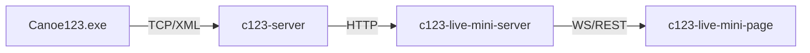

# c123-live-mini

Minimalistic live results solution for canoe slalom timing, part of the C123 ecosystem.

## Overview

Public-facing web application for displaying live race results from Canoe123 timing software. Designed as a lightweight, cloud-deployable service for spectators at venues and remote viewers.



## Tech Stack

| Layer | Technology |
|-------|------------|
| Monorepo | npm workspaces |
| Backend | Node.js, TypeScript, Fastify |
| Database | SQLite + Kysely |
| Frontend | React + Vite |
| Design System | [rvp-design-system](https://github.com/CzechCanoe/rvp-design-system/) |
| Deployment | Railway (planned) |

## Project Structure

```
packages/
├── server/     # Fastify API + WebSocket
├── client/     # React SPA
└── shared/     # Shared types and utilities
```

## Development

```bash
# Install dependencies
npm install

# Run development servers
npm run dev

# Build for production
npm run build

# Run tests
npm test
```

## Documentation

- [Architecture](docs/ARCHITECTURE.md) - System design, data flows, authentication
- [CLAUDE.md](CLAUDE.md) - AI assistant context and SDD workflow

## Related Projects

| Project | Description |
|---------|-------------|
| [c123-server](https://github.com/OpenCanoeTiming/c123-server) | Local timing server + Admin UI |
| [c123-protocol-docs](https://github.com/OpenCanoeTiming/c123-protocol-docs) | C123 protocol documentation |
| [rvp-design-system](https://github.com/CzechCanoe/rvp-design-system) | CSK public apps design system |

## License

MIT
