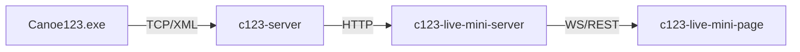

# c123-live-mini

Minimalistic live results solution for canoe slalom timing, part of the C123 ecosystem.

## Overview

Public-facing web application for displaying live race results from Canoe123 timing software. Designed as a lightweight, cloud-deployable service for spectators at venues and remote viewers.



## Tech Stack

| Layer | Technology |
|-------|------------|
| Monorepo | npm workspaces |
| Backend | Node.js, TypeScript, Fastify |
| Database | SQLite + Kysely |
| Frontend | React + Vite |
| Design System | [rvp-design-system](https://github.com/CzechCanoe/rvp-design-system/) |
| Deployment | Railway (planned) |

## Project Structure

```
c123-live-mini/
├── packages/
│   ├── server/              # Fastify API + WebSocket
│   │   ├── src/
│   │   │   ├── index.ts     # Server entry point
│   │   │   └── index.test.ts
│   │   ├── package.json
│   │   └── tsconfig.json
│   ├── client/              # React SPA
│   │   ├── src/
│   │   │   ├── main.tsx     # Client entry point
│   │   │   ├── App.tsx
│   │   │   └── App.test.tsx
│   │   ├── index.html
│   │   ├── package.json
│   │   ├── tsconfig.json
│   │   └── vite.config.ts
│   └── shared/              # Shared types and utilities
│       ├── src/
│       │   ├── index.ts     # Type exports
│       │   └── index.test.ts
│       ├── package.json
│       └── tsconfig.json
├── docs/
│   └── ARCHITECTURE.md      # System design
├── package.json             # Root workspace config
├── tsconfig.base.json       # Shared TypeScript config
└── vitest.workspace.ts      # Test configuration
```

## Prerequisites

- Node.js 20.x or higher
- npm 10.x or higher

## Development

```bash
# Install dependencies
npm install

# Run development servers (server + client concurrently)
npm run dev
# Server: http://localhost:3000
# Client: http://localhost:5173

# Work with specific package
npm run dev -w @c123-live-mini/server
npm run dev -w @c123-live-mini/client

# Build for production
npm run build

# Run tests
npm test
```

## Documentation

- [Architecture](docs/ARCHITECTURE.md) - System design, data flows, authentication
- [Data Model](docs/data-model.md) - Database schema, tables, XML mappings
- [CLAUDE.md](CLAUDE.md) - AI assistant context and SDD workflow

## Related Projects

| Project | Description |
|---------|-------------|
| [c123-server](https://github.com/OpenCanoeTiming/c123-server) | Local timing server + Admin UI |
| [c123-protocol-docs](https://github.com/OpenCanoeTiming/c123-protocol-docs) | C123 protocol documentation |
| [rvp-design-system](https://github.com/CzechCanoe/rvp-design-system) | CSK public apps design system |

## License

MIT
