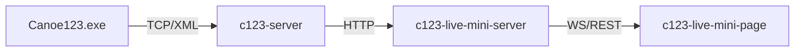

# c123-live-mini

Minimalistic live results solution for canoe slalom timing, part of the C123 ecosystem.

## Overview

Public-facing web application for displaying live race results from Canoe123 timing software. Designed as a lightweight, cloud-deployable service for spectators at venues and remote viewers.


```mermaid
flowchart LR
    C123[Canoe123.exe] -->|TCP/XML| SERVER[c123-server]
    SERVER -->|HTTP| MINI[c123-live-mini-server]
    MINI -->|WS/REST| PAGE[c123-live-mini-page]
```

## Tech Stack

| Layer | Technology |
|-------|------------|
| Monorepo | npm workspaces |
| Backend | Node.js, TypeScript, Fastify |
| Database | SQLite + Kysely |
| Frontend | React + Vite |
| Design System | [rvp-design-system](https://github.com/czechcanoe/rvp-design-system/) |
| Deployment | Docker (root `Dockerfile`) + [Railway](https://railway.app/) (`railway.toml`) |

## Project Structure

```
c123-live-mini/
├── packages/
│   ├── server/              # Fastify API + WebSocket
│   │   ├── src/
│   │   │   ├── index.ts     # Server entry point
│   │   │   └── index.test.ts
│   │   ├── package.json
│   │   └── tsconfig.json
│   ├── client/              # React SPA
│   │   ├── src/
│   │   │   ├── main.tsx     # Client entry point
│   │   │   ├── App.tsx
│   │   │   └── App.test.tsx
│   │   ├── index.html
│   │   ├── package.json
│   │   ├── tsconfig.json
│   │   └── vite.config.ts
│   └── shared/              # Shared types and utilities
│       ├── src/
│       │   ├── index.ts     # Type exports
│       │   └── index.test.ts
│       ├── package.json
│       └── tsconfig.json
├── docs/
│   └── ARCHITECTURE.md      # System design
├── package.json             # Root workspace config
├── tsconfig.base.json       # Shared TypeScript config
├── vitest.workspace.ts      # Test configuration
├── Dockerfile               # Multi-stage production image (Node 20)
├── .dockerignore            # Docker build context
└── railway.toml             # Railway builder, start command, healthcheck
```

## Prerequisites

- Node.js 20.x or higher
- npm 10.x or higher
- **GitHub Packages:** `@czechcanoe/rvp-design-system` is published to GitHub Packages. Configure npm auth before `npm install` or Docker builds — see [`.npmrc.example`](.npmrc.example) (token with `read:packages`, org SSO if required).

## Development

```bash
# Install dependencies
npm install

# Run development servers (server + client concurrently)
npm run dev
# Server: http://localhost:3000
# Client: http://localhost:5173

# Work with specific package
npm run dev -w @c123-live-mini/server
npm run dev -w @c123-live-mini/client

# Build for production
npm run build

# Run tests
npm test
```

## Environment Variables

| Variable | Default | Description |
|----------|---------|-------------|
| `PORT` | `3000` | Server port |
| `DATABASE_PATH` | `./data/live-mini.db` | SQLite database path |
| `MASTER_PASSWORDS` | *(empty)* | Comma-separated admin passwords. If not set, admin API is open. |

**Note:** This service uses **SQLite on a file path** via `DATABASE_PATH` only. It does **not** read `DATABASE_URL`. Managed or remote SQLite (e.g. Turso) would need a separate driver/Kysely change and is out of scope for the current deployment track unless explicitly added in a new issue.

## Deployment

### Local production smoke

```bash
npm run build
set NODE_ENV=production
npm run start -w @c123-live-mini/server
```

Then verify:

- `GET /health` → 200
- `GET /` → HTML shell (Vite SPA)
- `GET /api/v1/events` → JSON

Stop with Ctrl+C. On Windows PowerShell use `$env:NODE_ENV = "production"` instead of `set`.

### Docker

Build with a [BuildKit secret](https://docs.docker.com/build/building/secrets/) so the token is not baked into image layers (same scope as `NODE_AUTH_TOKEN` for npm):

```bash
# PowerShell: $env:NODE_AUTH_TOKEN = "ghp_..." 
# bash: export NODE_AUTH_TOKEN=ghp_...
docker build --secret id=npm_token,env=NODE_AUTH_TOKEN -t c123-live-mini .
```

The Dockerfile expects secret id `npm_token` (see `RUN --mount=type=secret,id=npm_token`).

Run (example with persistent DB on a named volume):

```bash
docker run --rm -p 3000:3000 \
  -e NODE_ENV=production \
  -e DATABASE_PATH=/data/live-mini.db \
  -e MASTER_PASSWORDS=your-secure-password \
  -v c123-live-mini-data:/data \
  c123-live-mini
```

Inside the image, `WORKDIR` is `/app` (monorepo layout). The default client assets path resolves to `packages/client/dist` relative to the server package; override with `CLIENT_DIST_PATH` if you copy files to a non-standard layout.

### SQLite on Railway

| Option | When to choose | Trade-off |
|--------|----------------|-----------|
| **A. Railway volume** | Database must survive redeploys and restarts (typical race weekend) | You must mount a volume and set `DATABASE_PATH` to a path **inside** that mount (e.g. `/data/live-mini.db`). |
| **B. Ephemeral disk** | Fastest first deploy / smoke; data can be empty after each deploy | Simplest; state is rebuilt from c123-server ingest if you run ingest again. |
| **C. Turso / LibSQL** | Managed remote SQLite at scale | **Not supported** by the current codebase without new drivers and Kysely configuration — track separately if needed. |

**Recommendation:** Use **B** for a quick Railway smoke and **A** when you need the SQLite file to persist. Set `DATABASE_PATH` accordingly (for **A**, align the path with the volume mount).

### Railway

The repo includes [`railway.toml`](railway.toml): Dockerfile builder, `startCommand` `node packages/server/dist/index.js`, and `healthcheckPath` `/health`.

**Variables (runtime):** `NODE_ENV=production`, `PORT` (Railway usually injects), `DATABASE_PATH` (e.g. `/data/live-mini.db` when using a volume), `MASTER_PASSWORDS`, `LOG_LEVEL`. See [`packages/server/README.md`](packages/server/README.md) for the full list.

**Build secret:** Add `NODE_AUTH_TOKEN` (GitHub Packages read token) in Railway as a **build-time** variable / secret so the Docker build can run `npm ci`. Do not commit tokens; follow [`.npmrc.example`](.npmrc.example).

Optional: attach a **volume** and set `DATABASE_PATH` to a file path on that volume for persistent SQLite (option **A** above).

### Railway smoke checklist (manual)

After deploy, confirm:

1. `GET https://<your-service>/health` → 200
2. `GET https://<your-service>/` → HTML document
3. `GET https://<your-service>/api/v1/events` → JSON (may be `[]` on empty DB)
4. WebSocket: connect to `wss://<your-service>/api/v1/events/<eventId>/ws` for a known event (seed or create via admin ingest flow as needed)

Capture any platform-specific follow-ups in the PR that closes deployment work.

### Upstream PR

When opening a pull request against [OpenCanoeTiming/c123-live-mini](https://github.com/OpenCanoeTiming/c123-live-mini) for deployment packaging, use **`Closes #117`** (or `Fixes #117`) in the PR description if the change is intended to complete [issue #117](https://github.com/OpenCanoeTiming/c123-live-mini/issues/117).

## Documentation

- [Architecture](docs/ARCHITECTURE.md) - System design, data flows, authentication
- [Data Model](docs/data-model.md) - Database schema, tables, XML mappings
- [CLAUDE.md](CLAUDE.md) - AI assistant context

## Related Projects

| Project | Description |
|---------|-------------|
| [c123-server](https://github.com/OpenCanoeTiming/c123-server) | Local timing server + Admin UI |
| [c123-protocol-docs](https://github.com/OpenCanoeTiming/c123-protocol-docs) | C123 protocol documentation |
| [rvp-design-system](https://github.com/czechcanoe/rvp-design-system) | CSK public apps design system |

## License

MIT
