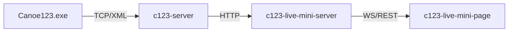

# c123-live-mini

Minimalistic live results solution for canoe slalom timing, part of the C123 ecosystem.

## Overview

Public-facing web application for displaying live race results from Canoe123 timing software. Designed as a lightweight, cloud-deployable service for spectators at venues and remote viewers.


```mermaid
flowchart LR
    C123[Canoe123.exe] -->|TCP/XML| SERVER[c123-server]
    SERVER -->|HTTP| MINI[c123-live-mini-server]
    MINI -->|WS/REST| PAGE[c123-live-mini-page]
```

## Tech Stack

| Layer | Technology |
|-------|------------|
| Monorepo | npm workspaces |
| Backend | Node.js, TypeScript, Fastify |
| Database | SQLite + Kysely |
| Frontend | React + Vite |
| Design System | [rvp-design-system](https://github.com/CzechCanoe/rvp-design-system/) |
| Deployment | Railway (Nixpacks, single-origin) |

## Project Structure

```
c123-live-mini/
├── packages/
│   ├── server/              # Fastify API + WebSocket
│   │   ├── src/
│   │   │   ├── index.ts     # Server entry point
│   │   │   └── index.test.ts
│   │   ├── package.json
│   │   └── tsconfig.json
│   ├── client/              # React SPA
│   │   ├── src/
│   │   │   ├── main.tsx     # Client entry point
│   │   │   ├── App.tsx
│   │   │   └── App.test.tsx
│   │   ├── index.html
│   │   ├── package.json
│   │   ├── tsconfig.json
│   │   └── vite.config.ts
│   └── shared/              # Shared types and utilities
│       ├── src/
│       │   ├── index.ts     # Type exports
│       │   └── index.test.ts
│       ├── package.json
│       └── tsconfig.json
├── docs/
│   └── ARCHITECTURE.md      # System design
├── package.json             # Root workspace config
├── tsconfig.base.json       # Shared TypeScript config
└── vitest.workspace.ts      # Test configuration
```

## Prerequisites

- Node.js 20.x or higher
- npm 10.x or higher
- **GitHub Packages access:** the client depends on `@czechcanoe/rvp-design-system` published to GitHub Packages. Before running `npm install`, set `NODE_AUTH_TOKEN` in your environment — see [`.npmrc.example`](.npmrc.example) for step-by-step instructions.

## Development

```bash
# Install dependencies
npm install

# Run development servers (server + client concurrently)
npm run dev
# Server: http://localhost:3000
# Client: http://localhost:5173

# Work with specific package
npm run dev -w @c123-live-mini/server
npm run dev -w @c123-live-mini/client

# Build for production
npm run build

# Run tests
npm test
```

## Environment Variables

| Variable | Default | Scope | Description |
|----------|---------|-------|-------------|
| `NODE_ENV` | *(empty)* | runtime | Set to `production` to enable single-origin SPA serving and admin safety checks. |
| `PORT` | `3000` | runtime | Server port. Railway injects this automatically. |
| `DATABASE_PATH` | `./data/live-mini.db` | runtime | SQLite database path. **For Railway, set this to a path on the mounted volume, e.g. `/data/live-mini.db`** — otherwise data is lost on redeploy. |
| `MASTER_PASSWORDS` | *(empty)* | runtime | Comma-separated admin passwords. Required in production unless `ADMIN_OPEN=1` is set for bootstrap. |
| `ADMIN_OPEN` | *(empty)* | runtime | Set to `1` to temporarily allow open admin API in production (for initial Railway bootstrap). Always set `MASTER_PASSWORDS` as soon as the first event is created. |
| `CLIENT_DIST_PATH` | *(auto)* | runtime | Override for the client SPA dist directory. Defaults to `packages/client/dist` relative to the server package. |
| `LOG_LEVEL` | `info` | runtime | Fastify logger level. |
| `NODE_AUTH_TOKEN` | *(empty)* | build | GitHub Packages token with `read:packages`. Required at install/build time (locally, CI, Railway build). Not used at runtime. |

## Deployment

c123-live-mini deploys to [Railway](https://railway.app/) as a single Nixpacks-built Node.js service. The Fastify server serves API, WebSocket, and the client SPA from the same origin — see [Architecture → Production Deployment Model](docs/ARCHITECTURE.md#production-deployment-model).

### Local production smoke test

Before pushing anything to Railway, verify the production path works locally:

```bash
npm run build
NODE_ENV=production MASTER_PASSWORDS=test PORT=3000 \
  node packages/server/dist/index.js
```

Then in another terminal:

```bash
curl http://localhost:3000/health                  # {"status":"ok"}
curl -I http://localhost:3000/                      # 200, text/html
curl http://localhost:3000/api/v1/events            # {"events":[]}
curl -I http://localhost:3000/api/v1/nonexistent    # 404, application/json
```

### Railway auto-deploy flow

The project uses **two Railway environments within one Railway project**, each watching a different GitHub branch:

| Environment | Watched branch | Purpose |
|-------------|----------------|---------|
| `staging` | `main` | Auto-deploys on every merge to `main`. For integration testing and dev feedback. |
| `production` | `production` | Auto-deploys on every merge to the `production` branch. Release via PR `main → production`. |

Both environments use their own Railway Volume mounted at `/data` and their own set of environment variables (different `MASTER_PASSWORDS`, same `NODE_AUTH_TOKEN`). See issue [#117](https://github.com/OpenCanoeTiming/c123-live-mini/issues/117) for the step-by-step Railway setup checklist.

### First-time admin bootstrap

Because the server refuses to start in `NODE_ENV=production` with an empty `MASTER_PASSWORDS`, the very first deploy uses a bootstrap flow:

1. In Railway, set `ADMIN_OPEN=1` **instead of** `MASTER_PASSWORDS` on the first deploy. The server starts with loud warnings in the log.
2. Create the first event via the admin API (no `X-Master-Key` header needed yet):
   ```bash
   curl -X POST https://<your-service>/api/v1/admin/events \
     -H "Content-Type: application/json" \
     -d '{"eventId":"bootstrap","mainTitle":"Bootstrap"}'
   ```
   The response contains an `apiKey` used for data ingestion.
3. In Railway, remove `ADMIN_OPEN` and set `MASTER_PASSWORDS=<strong password>`. Redeploy — the server now starts silently with admin endpoints protected.
4. Verify: `curl -X POST https://<your-service>/api/v1/admin/events` should return `401 Unauthorized`, and the same call with `-H "X-Master-Key: <password>"` should succeed.

### Cost strategy

Railway pricing (pay-as-you-go, 2026):

| Plan | Monthly fee | Included credit | Volume limit |
|------|-------------|-----------------|--------------|
| **Free** | $0 | $1 usage credit | 0.5 GB per service |
| **Hobby** | $5 | $5 usage credit | 5 GB per service |

This project is designed to run on **Free plan with Serverless sleep** between races. Expected usage pattern:

- Idle between races (both services sleeping): ~$0.10–0.15/month
- Race weekend (12-hour race day, ~200 concurrent spectators): ~$0.80
- 6 races per year: ~$7/year total — well within Free credit

**Upgrade to Hobby manually 1–2 days before each race** as a safety margin against mid-race shutdowns if the Free credit is close to exhaustion, then downgrade back to Free after the race. Estimated total cost: **~$10–25/year** depending on number of races and actual sleep reliability.

If Serverless sleep proves unreliable for WebSocket-heavy traffic, switch to permanent Hobby ($5/month flat, ~$60/year) for predictability.

### Pause / resume between races

Two options:

1. **Keep Serverless mode on Free plan** — services sleep automatically after 10 minutes without outbound traffic. Nothing to do manually. Cold start on first request after sleep is ~5–10 seconds.
2. **Manually stop services** in Railway UI between races. Volume persists, no compute billed. Manual redeploy required before the next race.

### Troubleshooting

- **First Railway build takes 5–10 minutes** — `npm ci` from a cold cache is slow, subsequent builds are much faster thanks to Nixpacks layer caching.
- **`npm ci` fails with 401** — `NODE_AUTH_TOKEN` is missing or has no `read:packages` scope / no SSO authorization for `CzechCanoe` org.
- **WebSocket drops after Serverless sleep** — expected for the first connection after a cold start. Clients should reconnect automatically (see `useEventWebSocket` hook).
- **Server refuses to start with `[FATAL] NODE_ENV=production with no MASTER_PASSWORDS`** — the admin safety policy is doing its job. Set `MASTER_PASSWORDS` or, for bootstrap only, `ADMIN_OPEN=1`.

## Documentation

- [Architecture](docs/ARCHITECTURE.md) - System design, data flows, authentication
- [Data Model](docs/data-model.md) - Database schema, tables, XML mappings
- [CLAUDE.md](CLAUDE.md) - AI assistant context

## Related Projects

| Project | Description |
|---------|-------------|
| [c123-server](https://github.com/OpenCanoeTiming/c123-server) | Local timing server + Admin UI |
| [c123-protocol-docs](https://github.com/OpenCanoeTiming/c123-protocol-docs) | C123 protocol documentation |
| [rvp-design-system](https://github.com/CzechCanoe/rvp-design-system) | CSK public apps design system |

## License

MIT
