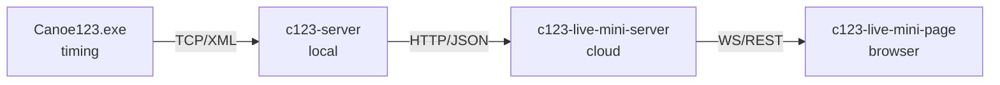
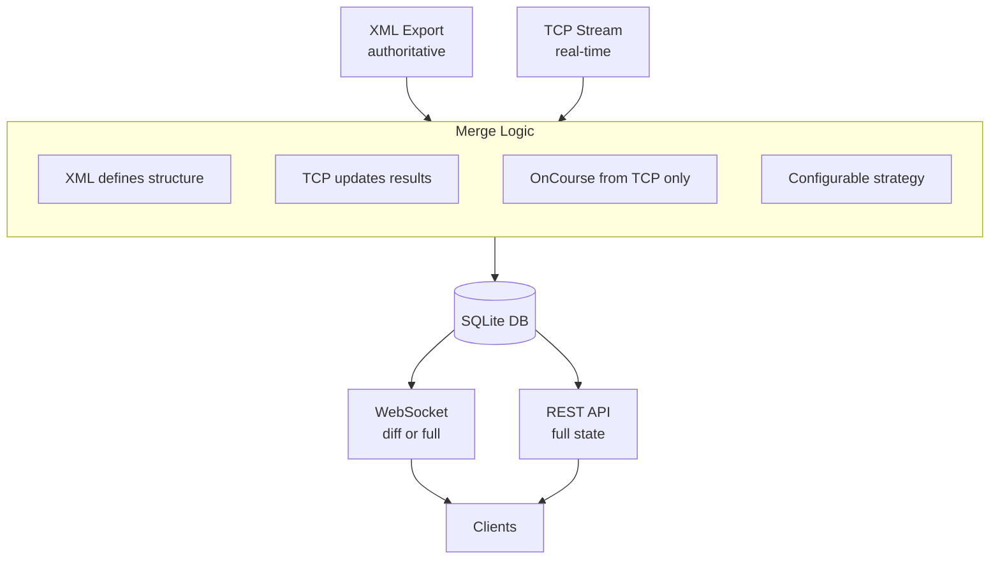
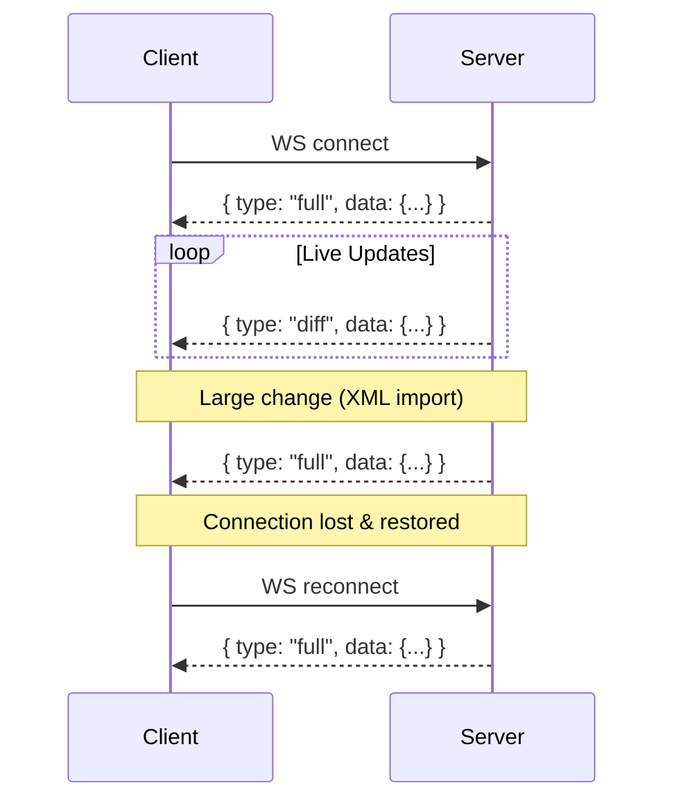
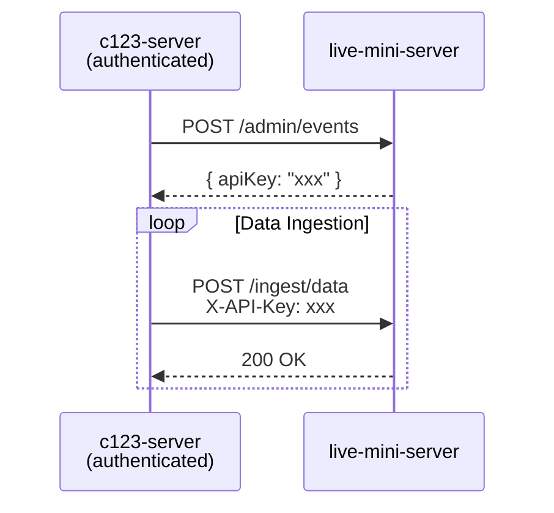
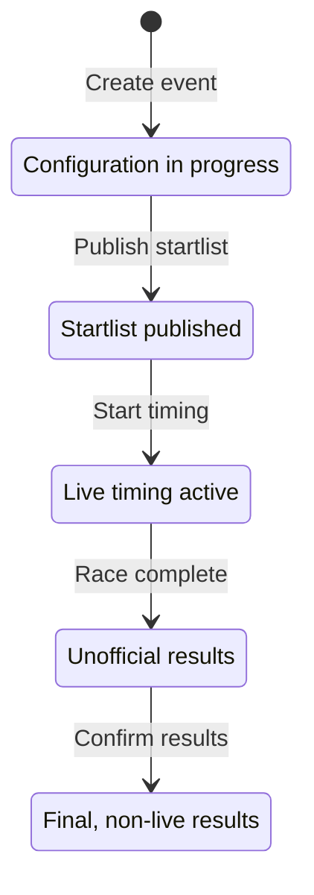

# Architecture

## System Overview

### Component Roles

| Component | Location | Role |
|-----------|----------|------|
| **Canoe123.exe** | Timing booth | Original timing software (unchanged) |
| **c123-server** | Local network | Data bridge + Admin UI for live-mini |
| **c123-live-mini-server** | Cloud (Railway) | Headless API, data persistence |
| **c123-live-mini-page** | User's browser | Public SPA for live results |

### Key Design Decisions

- **Headless API:** live-mini-server has no Admin UI - administration happens via c123-server
- **Single Active Event:** Only one event can receive data at a time (per API key)
- **Mobile-First:** Frontend optimized for spectators on phones at the venue

---

## Data Flow

### Data Sources

| Source | Data Type | Characteristics |
|--------|-----------|-----------------|
| **XML export** | Full state (startlist, results, schedule, classes) | Complete but may be stale |
| **TCP stream** | OnCourse (athletes on course), live Results | Real-time, incremental only |

### Merge Strategy

**Merge Rules:**
1. XML is authoritative for structure (categories, athletes, schedule)
2. Results from TCP incrementally update XML data
3. OnCourse data comes exclusively from TCP
4. XML should be sent frequently (after each state change, not just category switches)
5. Strategy is configurable for optimization based on real-world testing

### Client Data Distribution

**REST API:**
- Initial page load (full state)
- Fallback when WebSocket unavailable
- SEO/sharing (static snapshot)

**WebSocket (hybrid approach):**

Server decides what to send based on situation:

| Message Type | When Used | Payload |
|--------------|-----------|---------|
| `diff` | Incremental updates (single result, OnCourse change) | Changed data only |
| `full` | After reconnect, large changes (new XML import), server restart | Complete state |
| `refresh` | Signal to client to discard cache and fetch via REST | Empty |

---

## Authentication

### API Key per Event

- **Generation:** API key created when timekeeper authenticates and creates event
- **Validity:** Several days (duration of the event)
- **Usage:** Key in header of every ingest request
- **Scope:** One key = one event = prevents cross-event data leaks

---

## Data Model Principles

### Event Lifecycle

### Public Data Policy

- System publishes only necessary data for live display
- Prevents harvesting of complete authentic data
- Detailed athlete info (birth dates, clubs) may be filtered or aggregated

---

## Frontend Architecture

### Design System Integration

| Design System | Purpose | Used In |
|--------------|---------|---------|
| [rvp-design-system](https://github.com/CzechCanoe/rvp-design-system/) | Public-facing CSK apps | live-mini-page |
| [timing-design-system](https://github.com/OpenCanoeTiming/timing-design-system/) | Internal timing tools | c123-server Admin UI |

### Satellite Mode

This application uses **rvp-design-system in "satellite" variant**:

- **Standalone operation**: Can run independently outside kanoe.cz domain
- **Independent branding**: Uses CSK visual identity but doesn't require portal integration
- **Custom domains**: Enables deployment on event-specific or timing-specific URLs
- **No portal dependencies**: Works without kanoe.cz authentication or navigation

This follows the Live Page Prototype from rvp-design-system as the reference implementation.

### Display Modes

- **Simple:** Times + penalties, ranking, age category - for general public
- **Detailed:** Gate times, split times, detailed penalties - for insiders

### Filtering

- Filter by age category with ranking within category
- Categories derived dynamically from event configuration (not hardcoded)

---

## Integration Context

This service is designed as a standalone component that will eventually integrate into a larger Czech Canoe Federation (CSK) registration portal system.

### Future Integration Points

- Event data may link to registration system
- Results may feed into ranking/points databases
- API design should anticipate these integrations

---

## Related Documentation

- [c123-protocol-docs](../c123-protocol-docs/) - XML formats, TCP protocol details
- [c123-server](../c123-server/) - Local server, Admin client implementation
