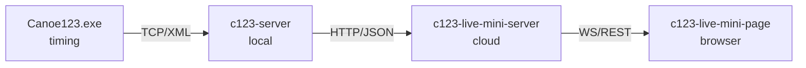
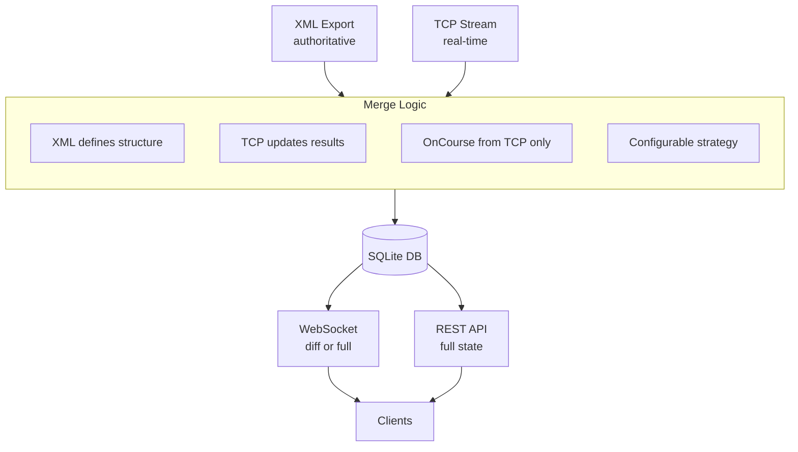
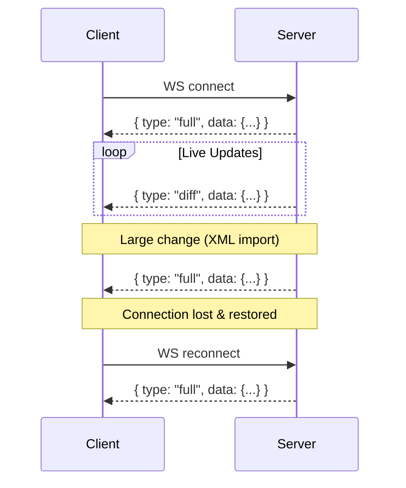
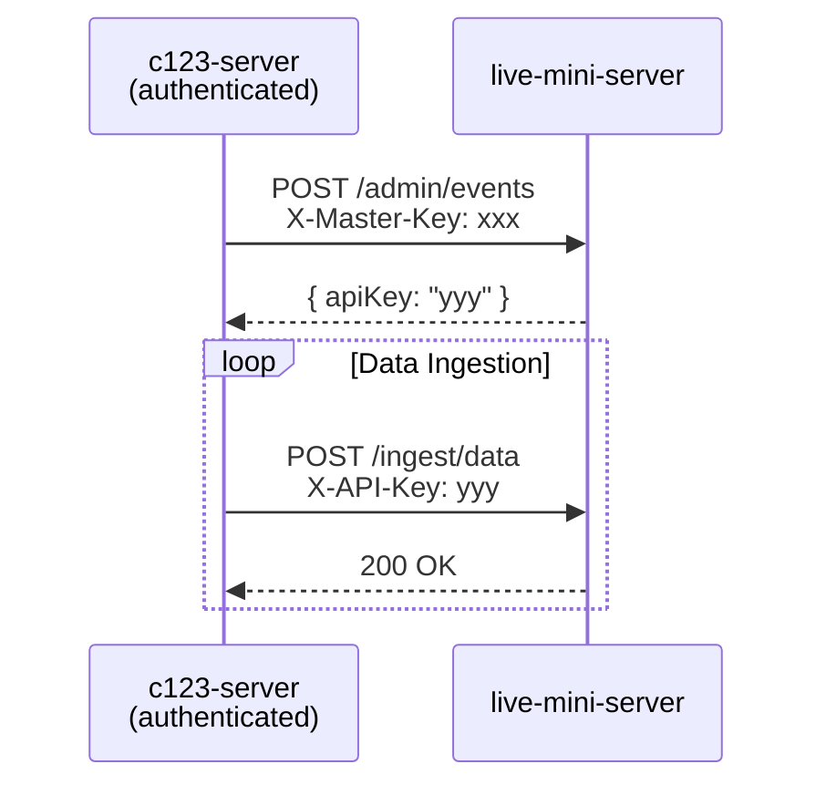
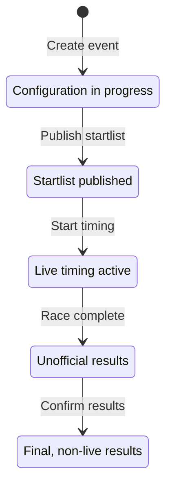
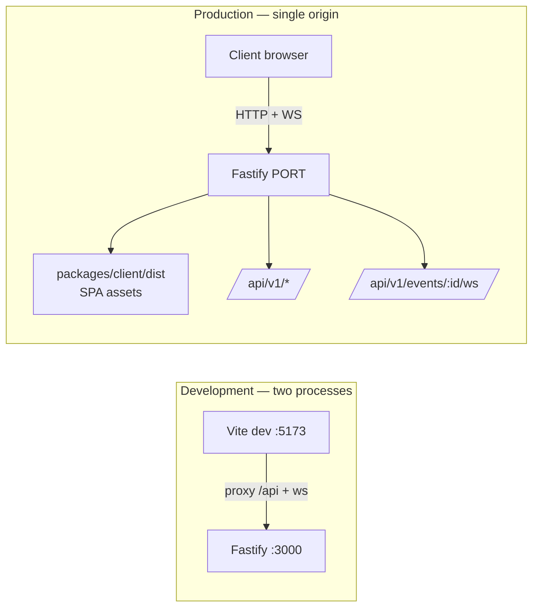

# Architecture

## System Overview

```mermaid
flowchart LR
    C123[Canoe123.exe<br/>timing] -->|TCP/XML| SERVER[c123-server<br/>local]
    SERVER -->|HTTP/JSON| MINI[c123-live-mini-server<br/>cloud]
    MINI -->|WS/REST| PAGE[c123-live-mini-page<br/>browser]
```

### Component Roles

| Component | Location | Role |
|-----------|----------|------|
| **Canoe123.exe** | Timing booth | Original timing software (unchanged) |
| **c123-server** | Local network | Data bridge + Admin UI for live-mini |
| **c123-live-mini-server** | Cloud (Railway) | Headless API, data persistence |
| **c123-live-mini-page** | User's browser | Public SPA for live results |

### Key Design Decisions

- **Headless API:** live-mini-server has no Admin UI - administration happens via c123-server
- **Single Active Event:** Only one event can receive data at a time (per API key)
- **Mobile-First:** Frontend optimized for spectators on phones at the venue

---

## Data Flow

### Data Sources

| Source | Data Type | Characteristics |
|--------|-----------|-----------------|
| **XML export** | Full state (startlist, results, schedule, classes) | Complete but may be stale |
| **TCP stream** | OnCourse (athletes on course), live Results | Real-time, incremental only |

### Merge Strategy

```mermaid
flowchart TB
    XML[XML Export<br/>authoritative] --> MERGE
    TCP[TCP Stream<br/>real-time] --> MERGE

    subgraph MERGE[Merge Logic]
        direction TB
        M1[XML defines structure]
        M2[TCP updates results]
        M3[OnCourse from TCP only]
        M4[Configurable strategy]
    end

    MERGE --> DB[(SQLite DB)]
    DB --> WS[WebSocket<br/>diff or full]
    DB --> REST[REST API<br/>full state]
    WS --> CLIENTS[Clients]
    REST --> CLIENTS
```

**Merge Rules:**
1. XML is authoritative for structure (categories, athletes, schedule)
2. Results from TCP incrementally update XML data
3. OnCourse data comes exclusively from TCP
4. XML should be sent frequently (after each state change, not just category switches)
5. Strategy is configurable for optimization based on real-world testing

### Client Data Distribution

**REST API:**
- Initial page load (full state)
- Fallback when WebSocket unavailable
- SEO/sharing (static snapshot)

**WebSocket (hybrid approach):**

Server decides what to send based on situation:

| Message Type | When Used | Payload |
|--------------|-----------|---------|
| `diff` | Incremental updates (single result, OnCourse change) | Changed data only |
| `full` | After reconnect, large changes (new XML import), server restart | Complete state |
| `refresh` | Signal to client to discard cache and fetch via REST | Empty |

```mermaid
sequenceDiagram
    participant C as Client
    participant S as Server

    C->>S: WS connect
    S-->>C: { type: "full", data: {...} }

    loop Live Updates
        S-->>C: { type: "diff", data: {...} }
    end

    Note over C,S: Large change (XML import)
    S-->>C: { type: "full", data: {...} }

    Note over C,S: Connection lost & restored
    C->>S: WS reconnect
    S-->>C: { type: "full", data: {...} }
```

---

## Authentication

### Two-Level Auth

| Level | Header | Purpose | Protects |
|-------|--------|---------|----------|
| **Master Password** | `X-Master-Key` | Admin operations | Create/list/delete events |
| **Event API Key** | `X-API-Key` | Data ingestion | Ingest XML/results, status transitions |

### Master Password

- Configured via `MASTER_PASSWORDS` env var (comma-separated, supports multiple)
- Required for: `POST /admin/events`, `GET /admin/events`, `DELETE /admin/events/:id`
- If not configured: admin endpoints are open (development mode)

### API Key per Event

```mermaid
sequenceDiagram
    participant C as c123-server<br/>(authenticated)
    participant M as live-mini-server

    C->>M: POST /admin/events<br/>X-Master-Key: xxx
    M-->>C: { apiKey: "yyy" }

    loop Data Ingestion
        C->>M: POST /ingest/data<br/>X-API-Key: yyy
        M-->>C: 200 OK
    end
```

- **Generation:** API key created when event is created via admin API
- **Validity:** Several days (duration of the event)
- **Usage:** Key in header of every ingest request
- **Scope:** One key = one event = prevents cross-event data leaks

### Event ID Independence

The `eventId` in live-mini is **independent** from the C123 `EventId` in XML. This allows using national race numbers or custom identifiers as live event IDs. Pairing of XML data to events is done exclusively via the API key — the XML `EventId` is not checked.

### Event Image

Events can have an associated image (logo/avatar), uploaded as base64 via the admin API (`imageData` field). The image is served at `GET /api/v1/events/:eventId/image` as a public, cacheable endpoint.

---

## Data Model Principles

### Event Lifecycle

```mermaid
stateDiagram-v2
    [*] --> draft: Create event
    draft --> startlist: Publish startlist
    startlist --> running: Start timing
    running --> finished: Race complete
    finished --> official: Confirm results

    draft: Configuration in progress
    startlist: Startlist published
    running: Live timing active
    finished: Unofficial results
    official: Final, non-live results
```

### Public Data Policy

- System publishes only necessary data for live display
- Prevents harvesting of complete authentic data
- Detailed athlete info (birth dates, clubs) may be filtered or aggregated

---

## Frontend Architecture

### Design System Integration

| Design System | Purpose | Used In |
|--------------|---------|---------|
| [rvp-design-system](https://github.com/CzechCanoe/rvp-design-system/) | Public-facing CSK apps | live-mini-page |
| [timing-design-system](https://github.com/OpenCanoeTiming/timing-design-system/) | Internal timing tools | c123-server Admin UI |

### Satellite Mode

This application uses **rvp-design-system in "satellite" variant**:

- **Standalone operation**: Can run independently outside kanoe.cz domain
- **Independent branding**: Uses CSK visual identity but doesn't require portal integration
- **Custom domains**: Enables deployment on event-specific or timing-specific URLs
- **No portal dependencies**: Works without kanoe.cz authentication or navigation

This follows the Live Page Prototype from rvp-design-system as the reference implementation.

### Display Modes

- **Simple:** Times + penalties, ranking, age category - for general public
- **Detailed:** Gate times, split times, detailed penalties - for insiders

### Filtering

- Filter by age category with ranking within category
- Categories derived dynamically from event configuration (not hardcoded)

---

## Production Deployment Model

In production, c123-live-mini runs as a **single Fastify process** that serves the REST API, the WebSocket endpoint, and the client SPA from the same origin. This is different from the development setup, where Vite's dev server runs separately on port 5173 and proxies `/api` to Fastify on port 3000.

```mermaid
flowchart LR
    subgraph DEV[Development — two processes]
        VITE[Vite dev :5173] -->|proxy /api + ws| FASTIFY_DEV[Fastify :3000]
    end

    subgraph PROD[Production — single origin]
        CLIENT_PROD[Client browser] -->|HTTP + WS| FASTIFY_PROD[Fastify PORT]
        FASTIFY_PROD --> STATIC[packages/client/dist<br/>SPA assets]
        FASTIFY_PROD --> API[/api/v1/*/]
        FASTIFY_PROD --> WS[/api/v1/events/:id/ws/]
    end
```

### Why single-origin

- **No CORS configuration needed** — client and server share the origin
- **No separate WebSocket URL config** — client uses `window.location.host` dynamically
- **One Railway service** — simpler deployment, one volume, one healthcheck, one billing line
- **Simpler environment** — client uses relative paths (`/api/v1/...`), no env-based API base URL

### Static file serving implementation

Production SPA hosting is registered in `packages/server/src/registerProductionSpa.ts`. It's only active when `NODE_ENV=production`, and only when the client `dist` directory is resolvable (default: `packages/client/dist` relative to the server package; overridable via `CLIENT_DIST_PATH`).

The registration happens inside a nested `app.register(async instance => ...)` plugin so cache headers and the 404 handler stay encapsulated from the API context. Three key configuration choices:

1. **`wildcard: false`** on `@fastify/static` — the default catch-all `GET /*` handler would conflict with `/api/*` routes and `@fastify/websocket`'s upgrade interception.
2. **`index: false`** — disables auto-serving `index.html` on `/`; the `setNotFoundHandler` handles it centrally so the SPA fallback logic is in one place.
3. **`setNotFoundHandler`** in the nested scope — for unknown paths:
   - If URL starts with `/api` or `/api/`, return **JSON 404** (so client-side API error handling is predictable).
   - If method is not GET/HEAD, return JSON 404.
   - Otherwise, serve `index.html` so the React Router / wouter router can handle the client-side route.

Cache headers:

- `index.html` → `no-store, max-age=0` (SPA shell should always be fresh)
- Hashed assets (`index-X3H2G8hJ.js` etc.) → `public, max-age=31536000, immutable`

### Admin API safety in production

When `NODE_ENV=production`, the server **refuses to start** if `MASTER_PASSWORDS` is empty unless `ADMIN_OPEN=1` is explicitly set. This prevents accidentally deploying a public URL with an open admin endpoint. The `ADMIN_OPEN=1` path is intended only for the initial Railway bootstrap — it logs loud warnings on every start and should be removed as soon as the first event is created and `MASTER_PASSWORDS` is configured.

### Dependencies between dev and prod modes

The same Fastify app factory (`createApp` in `app.ts`) is used in both modes. The only difference is:

- In dev, `registerProductionSpa` is a no-op (NODE_ENV check)
- In prod, it registers the static + SPA fallback nested plugin at the end of route setup

`createApp` remains **synchronous** — `registerProductionSpa` uses `app.register` which is fire-and-forget, so no async migration is needed in call sites. WebSocket routes and API routes are unchanged between dev and prod.

---

## Integration Context

This service is designed as a standalone component that will eventually integrate into a larger Czech Canoe Federation (CSK) registration portal system.

### Future Integration Points

- Event data may link to registration system
- Results may feed into ranking/points databases
- API design should anticipate these integrations

---

## Related Documentation

- [c123-protocol-docs](../c123-protocol-docs/) - XML formats, TCP protocol details
- [c123-server](../c123-server/) - Local server, Admin client implementation
