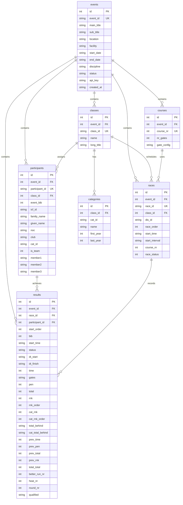

# Data Model: c123-live-mini

**Version**: 1.0 | **Updated**: 2026-02-05
**Source**: [c123-protocol-docs/c123-xml-format.md](../../../c123-protocol-docs/c123-xml-format.md)

## Entity-Relationship Diagram



## Table Descriptions

### events

Primary event container. One event per competition.

| Column | Type | Description | XML Source |
|--------|------|-------------|------------|
| id | INTEGER | Auto-increment primary key | - |
| event_id | TEXT | Unique event ID (e.g., "CZE2.2024062500") | `<EventId>` |
| main_title | TEXT | Primary event name | `<MainTitle>` |
| sub_title | TEXT | Secondary title (optional) | `<SubTitle>` |
| location | TEXT | Venue city | `<Location>` |
| facility | TEXT | Specific facility name | `<Facility>` |
| start_date | TEXT | ISO date string | `<StartDate>` |
| end_date | TEXT | ISO date string | `<EndDate>` |
| discipline | TEXT | "Slalom", "Sprint", "WildWater" | `<CanoeDiscipline>` |
| status | TEXT | Event lifecycle state | - (derived) |
| api_key | TEXT | Authentication key for data ingestion | - (generated) |
| created_at | TEXT | ISO timestamp | - |

### classes

Race categories within an event.

| Column | Type | Description | XML Source |
|--------|------|-------------|------------|
| id | INTEGER | Auto-increment primary key | - |
| event_id | INTEGER | FK to events.id | - |
| class_id | TEXT | Unique class code (e.g., "K1M-ZS") | `<ClassId>` |
| name | TEXT | Short display name | `<Class>` |
| long_title | TEXT | Full descriptive name | `<LongTitle>` |

**ClassId Format**: `[Boat][Gender][-Type][-Age]`
- Boat: K1, C1, K2, C2
- Gender: M (men), W (women), X (mixed/cross)
- Type: Team, Sprint (SM/SW)
- Age: ZM (juniors), ZS (seniors), DM, DS, U23, V...

Examples: `K1M-ZS`, `C1W-Team`, `K1SM-ZS`, `K1XM-ZS` (Cross)

### categories

Age categories associated with classes.

| Column | Type | Description | XML Source |
|--------|------|-------------|------------|
| id | INTEGER | Auto-increment primary key | - |
| class_id | INTEGER | FK to classes.id | - |
| cat_id | TEXT | Category code (e.g., "ZS", "ZM") | `<CatId>` |
| name | TEXT | Category name | `<Category>` |
| first_year | INTEGER | Birth year range start | `<FirstYear>` |
| last_year | INTEGER | Birth year range end | `<LastYear>` |

### participants

Competitors (individuals or teams).

| Column | Type | Description | XML Source |
|--------|------|-------------|------------|
| id | INTEGER | Auto-increment primary key | - |
| event_id | INTEGER | FK to events.id | - |
| participant_id | TEXT | Unique ID (e.g., "60070.C1M.ZS") | `<Id>` |
| class_id | INTEGER | FK to classes.id | `<ClassId>` (lookup) |
| event_bib | INTEGER | Bib number for this event | `<EventBib>` |
| icf_id | TEXT | ICF/national registration number | `<ICFId>` |
| family_name | TEXT | Surname | `<FamilyName>` |
| given_name | TEXT | First name | `<GivenName>` |
| noc | TEXT | Country/region code | `<NOC>` |
| club | TEXT | Club name | `<Club>` |
| cat_id | TEXT | Age category | `<CatId>` |
| is_team | INTEGER | 0=individual, 1=team | `<IsTeam>` ("true"/"false") |
| member1 | TEXT | Team member 1 participant_id | `<Member1>` |
| member2 | TEXT | Team member 2 participant_id | `<Member2>` |
| member3 | TEXT | Team member 3 participant_id | `<Member3>` |

### races

Scheduled race runs within an event.

| Column | Type | Description | XML Source |
|--------|------|-------------|------------|
| id | INTEGER | Auto-increment primary key | - |
| event_id | INTEGER | FK to events.id | - |
| race_id | TEXT | Unique race ID (e.g., "K1M-ZS_BR1_25") | `<RaceId>` |
| class_id | INTEGER | FK to classes.id | `<ClassId>` (lookup) |
| dis_id | TEXT | Discipline/run type | `<DisId>` |
| race_order | INTEGER | Display order | `<RaceOrder>` |
| start_time | TEXT | Scheduled start time | `<StartTime>` |
| start_interval | TEXT | Interval between starts | `<StartInterval>` |
| course_nr | INTEGER | Course number (FK to courses) | `<CourseNr>` |
| race_status | INTEGER | Race state | `<RaceStatus>` |

**RaceId Format**: `[ClassId]_[DisId]_[Day]` (e.g., "K1M-ZS_BR1_25")

### results

Competition results linking races and participants.

| Column | Type | Description | XML Source |
|--------|------|-------------|------------|
| id | INTEGER | Auto-increment primary key | - |
| event_id | INTEGER | FK to events.id | - |
| race_id | INTEGER | FK to races.id | `<RaceId>` (lookup) |
| participant_id | INTEGER | FK to participants.id | `<Id>` (lookup) |
| start_order | INTEGER | Start position | `<StartOrder>` |
| bib | INTEGER | Bib number | `<Bib>` |
| start_time | TEXT | Scheduled start time | `<StartTime>` |
| status | TEXT | NULL=OK, "DNS", "DNF", "DSQ", "CAP" | `<Status>` |
| dt_start | TEXT | Precise start time (HH:MM:SS.mmm) | `<dtStart>` |
| dt_finish | TEXT | Precise finish time | `<dtFinish>` |
| time | INTEGER | Run time in hundredths | `<Time>` |
| gates | TEXT | Gate penalties (25-char string) | `<Gates>` |
| pen | INTEGER | Penalty time in hundredths | `<Pen>` |
| total | INTEGER | time + pen in hundredths | `<Total>` |
| rnk | INTEGER | Overall ranking | `<Rnk>` |
| rnk_order | INTEGER | Ranking order | `<RnkOrder>` |
| cat_rnk | INTEGER | Category ranking | `<CatRnk>` |
| cat_rnk_order | INTEGER | Category ranking order | `<CatRnkOrder>` |
| total_behind | TEXT | Time behind leader (+X.XX) | `<TotalBehind>` |
| cat_total_behind | TEXT | Category time behind | `<catTotalBehind>` |
| prev_time | INTEGER | Previous run time (BR2) | `<PrevTime>` |
| prev_pen | INTEGER | Previous run penalty (BR2) | `<PrevPen>` |
| prev_total | INTEGER | Previous run total (BR2) | `<PrevTotal>` |
| prev_rnk | INTEGER | Previous run rank | `<PrevRnk>` |
| total_total | INTEGER | Best time from both runs | `<TotalTotal>` |
| better_run_nr | INTEGER | 1 or 2 (which run was better) | `<BetterRunNr>` |
| heat_nr | INTEGER | Heat number (Cross) | `<HeatNr>` |
| round_nr | INTEGER | Round number (Cross: 1=X4, 2=XS, 3=XF) | `<RoundNr>` |
| qualified | TEXT | "Q" for qualified (Cross) | `<Qualified>` |

### courses

Gate configuration for race courses.

| Column | Type | Description | XML Source |
|--------|------|-------------|------------|
| id | INTEGER | Auto-increment primary key | - |
| event_id | INTEGER | FK to events.id | - |
| course_nr | INTEGER | Course number | `<CourseNr>` |
| nr_gates | INTEGER | Total gate count | - (derived from config) |
| gate_config | TEXT | Gate types sequence (N/R/S) | `<CourseConfig>` |

## Reference Data

### DisId (Run Type)

| DisId | Meaning | Format |
|-------|---------|--------|
| `BR1` | Best Run 1 (1st run) | Slalom |
| `BR2` | Best Run 2 (2nd run) | Slalom |
| `TSR` | Team Single Run | Slalom Teams |
| `SR` | Single Run (sprint) | Sprint |
| `QUA` | Qualification | International |
| `SEM` | Semifinal | International |
| `FIN` | Final | International |
| `XT` | Time Trial | Cross |
| `X4` | Heats of 4 | Cross |
| `XS` | Semifinal | Cross |
| `XF` | Final | Cross |
| `XER` | End Results | Cross |

### RaceStatus

| Value | Meaning |
|-------|---------|
| 1 | Scheduled |
| 2 | Entered |
| 3 | StartListOK |
| 4 | ComingUp |
| 5 | Delayed |
| 6 | Canceled |
| 7 | Postponed |
| 8 | InProgress |
| 9 | Delayed_In_Progress |
| 10 | Completed (unofficial) |
| 11 | Final (official results) |
| 12 | Revised |

### Result Status

| Status | Meaning |
|--------|---------|
| NULL/empty | Completed (OK) |
| `DNS` | Did Not Start |
| `DNF` | Did Not Finish |
| `DSQ` | Disqualified |
| `CAP` | Capsized |

### Gates Format

25-character string, each position represents a gate:

| Value | Meaning | Penalty |
|-------|---------|---------|
| `0` | Clean passage | 0s |
| `2` | Gate touch | +2s |
| `50` | Missed gate | +50s |

Example: `00000002000000000000000` (gate 7 touched = +2s penalty)

### CourseConfig Codes

| Code | Meaning |
|------|---------|
| `N` | Normal gate (downstream, green) |
| `R` | Reverse gate (upstream, red) |
| `S` | Separator/break |

Example: `NNRNSNNRNSRNNNSRNNNSRRNS` (24 gates)

## Cross Discipline Specifics

Cross races have different semantics than Slalom:

| Aspect | Slalom | Cross |
|--------|--------|-------|
| Course | CourseNr=1 (24 gates) | CourseNr=2,4 (6 gates) |
| Time in X4/XS/XF | Actual time (hundredths) | Finish order (1000, 2000, 3000, 4000) |
| Phases | BR1→BR2 | XT→X4→XS→XF→XER |
| Progression | `XT` (Time Trial) → `X4` (Heats) → `XS` (Semi) → `XF` (Final) → `XER` (End Results) |
| head_nr, round_nr | Not used | Used to track heat progression |
| qualified | Not used | "Q" indicates advancement |

## Event Status Lifecycle

```
draft → startlist → running → finished → official
```

| State | Description |
|-------|-------------|
| draft | Configuration in progress |
| startlist | Startlist published, waiting for race |
| running | Live timing active |
| finished | Race complete, unofficial results |
| official | Final, confirmed results |
